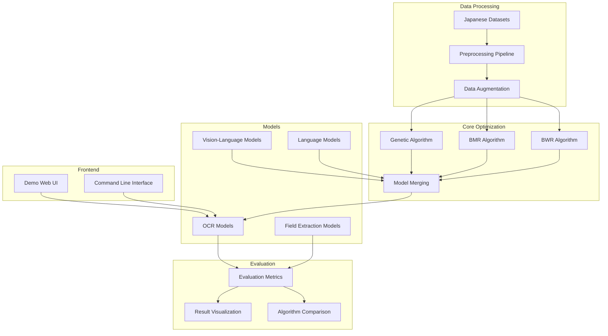
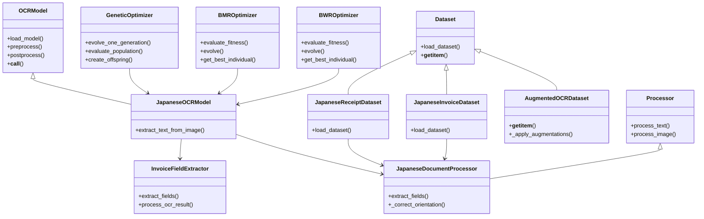
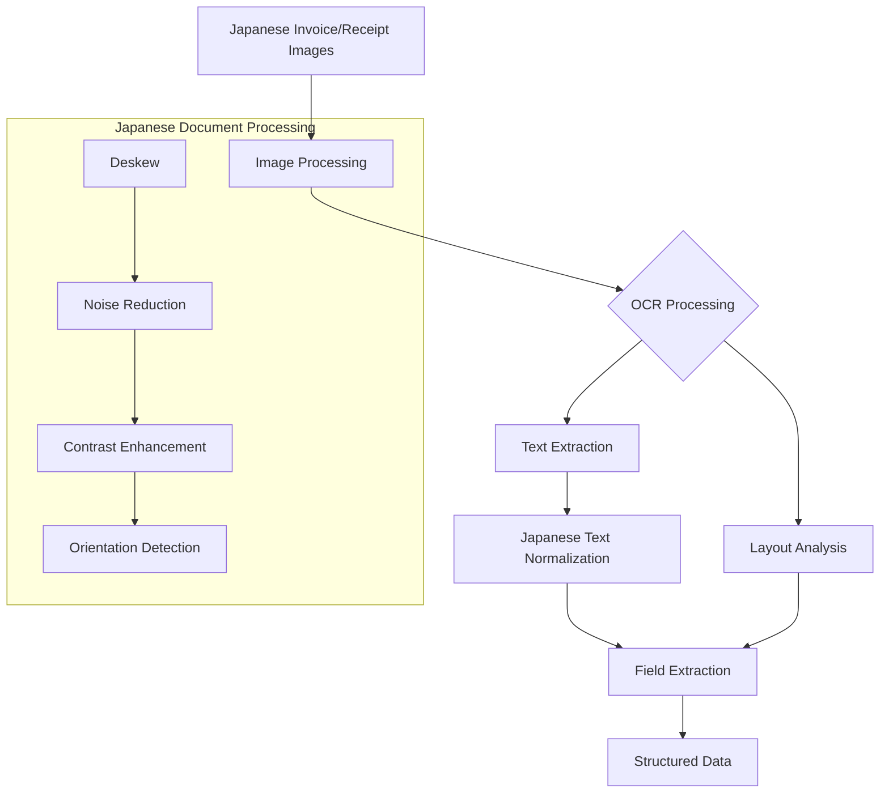
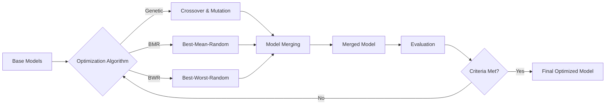
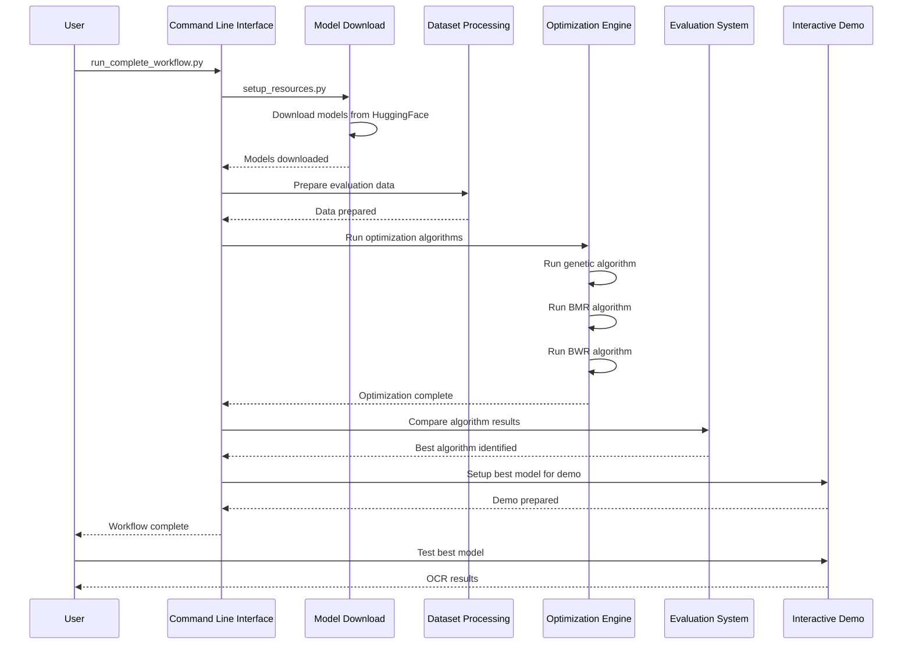
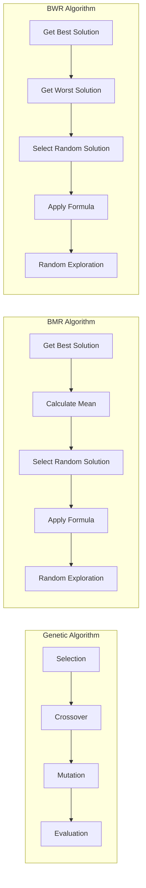

# BMR-Model-Merge Project Architecture

This document describes the detailed architecture of the BMR-model-merge project for Japanese invoice/receipt OCR using evolutionary model merging techniques.

## Overall System Architecture



## Module Relationships



## Data Workflow



## Optimization Process



## Complete System Workflow



## Component Structure

```mermaid
graph TD
    subgraph "Project Structure"
        CONFIG[configs/]
        EVOMERGE[evomerge/]
        ASSETS[assets/]
        DATA[data/]
        SCRIPTS[Scripts]
    end
    
    subgraph "Config Files"
        CONFIG --> CONFIG_EVOLUTION[evolution/]
        CONFIG --> CONFIG_LLM[llm/]
        CONFIG --> CONFIG_VLM[vlm/]
        
        CONFIG_EVOLUTION --> EVOLUTION_DEFAULT[default.yaml]
        CONFIG_EVOLUTION --> EVOLUTION_BMR_BWR[bmr_bwr_config.yaml]
    end
    
    subgraph "Core Components"
        EVOMERGE --> EVOMERGE_DATA[data/]
        EVOMERGE --> EVOMERGE_EVAL[eval/]
        EVOMERGE --> EVOMERGE_EVOLUTION[evolution/]
        EVOMERGE --> EVOMERGE_MODELS[models/]
        EVOMERGE --> EVOMERGE_PROCESSORS[processors/]
        
        EVOMERGE_DATA --> DATA_DATASETS[datasets.py]
        EVOMERGE_DATA --> DATA_PROCESSOR[processor.py]
        
        EVOMERGE_EVOLUTION --> EVOLUTION_GENETIC[genetic.py]
        EVOMERGE_EVOLUTION --> EVOLUTION_BMR[bmr.py]
        EVOMERGE_EVOLUTION --> EVOLUTION_BWR[bwr.py]
        
        EVOMERGE_MODELS --> MODELS_BASE[base_ocr.py]
        EVOMERGE_MODELS --> MODELS_JAPANESE[japanese_ocr.py]
        EVOMERGE_MODELS --> MODELS_FIELD[field_extractor.py]
    end
    
    subgraph "Scripts"
        SCRIPTS --> SCRIPT_DEMO[demo.py]
        SCRIPTS --> SCRIPT_EVALUATE[evaluate.py]
        SCRIPTS --> SCRIPT_OPTIMIZE[run_optimization.py]
        SCRIPTS --> SCRIPT_WORKFLOW[run_complete_workflow.py]
        SCRIPTS --> SCRIPT_SETUP[setup_resources.py]
        SCRIPTS --> SCRIPT_COMPARE[compare_results.py]
    end
    
    subgraph "Data"
        DATA --> DATA_SAMPLE[sample_config.yaml]
    end
```



## Optimization Algorithm Comparison



## BMR Algorithm Workflow

```mermaid
flowchart TD
    START[Start BMR Algorithm] --> INIT[Initialize Population]
    INIT --> EVAL[Evaluate Fitness]
    EVAL --> BEST[Identify Best Individual]
    BEST --> MEAN[Calculate Mean of Population]
    MEAN --> LOOP{For Each Individual}
    LOOP --> RANDOM[Pick Random Individual]
    RANDOM --> PROB{Random >= 0.5?}
    
    PROB -->|Yes| EXPLOIT[Apply BMR Formula:<br>V' = V + r1(Best - T×Mean) + r2(Best - Random)]
    PROB -->|No| EXPLORE[Apply Random Exploration:<br>V' = Upper - (Upper-Lower)×r3]
    
    EXPLOIT --> NEXT[Next Individual]
    EXPLORE --> NEXT
    NEXT --> LOOP_END{End of Population?}
    LOOP_END -->|No| LOOP
    LOOP_END -->|Yes| ELITISM[Preserve Elite Individuals]
    ELITISM --> NEXT_GEN[Next Generation]
    NEXT_GEN --> TERM{Termination?}
    TERM -->|No| EVAL
    TERM -->|Yes| END[Return Best Solution]
```

## BWR Algorithm Workflow

```mermaid
flowchart TD
    START[Start BWR Algorithm] --> INIT[Initialize Population]
    INIT --> EVAL[Evaluate Fitness]
    EVAL --> BEST[Identify Best Individual]
    BEST --> WORST[Identify Worst Individual]
    WORST --> LOOP{For Each Individual}
    LOOP --> RANDOM[Pick Random Individual]
    RANDOM --> PROB{Random >= 0.5?}
    
    PROB -->|Yes| EXPLOIT[Apply BWR Formula:<br>V' = V + r1(Best - T×Random) - r2(Worst - Random)]
    PROB -->|No| EXPLORE[Apply Random Exploration:<br>V' = Upper - (Upper-Lower)×r3]
    
    EXPLOIT --> NEXT[Next Individual]
    EXPLORE --> NEXT
    NEXT --> LOOP_END{End of Population?}
    LOOP_END -->|No| LOOP
    LOOP_END -->|Yes| ELITISM[Preserve Elite Individuals]
    ELITISM --> NEXT_GEN[Next Generation]
    NEXT_GEN --> TERM{Termination?}
    TERM -->|No| EVAL
    TERM -->|Yes| END[Return Best Solution]
```

## Japanese OCR Pipeline

```mermaid
flowchart TD
    START[Japanese Invoice/Receipt] --> PREPROC[Image Preprocessing]
    PREPROC --> OCR[OCR Model]
    OCR --> TEXT[Raw Text Extraction]
    TEXT --> NORM[Japanese Text Normalization]
    NORM --> FIELD[Field Extraction]
    FIELD --> STRUCT[Structured Data]