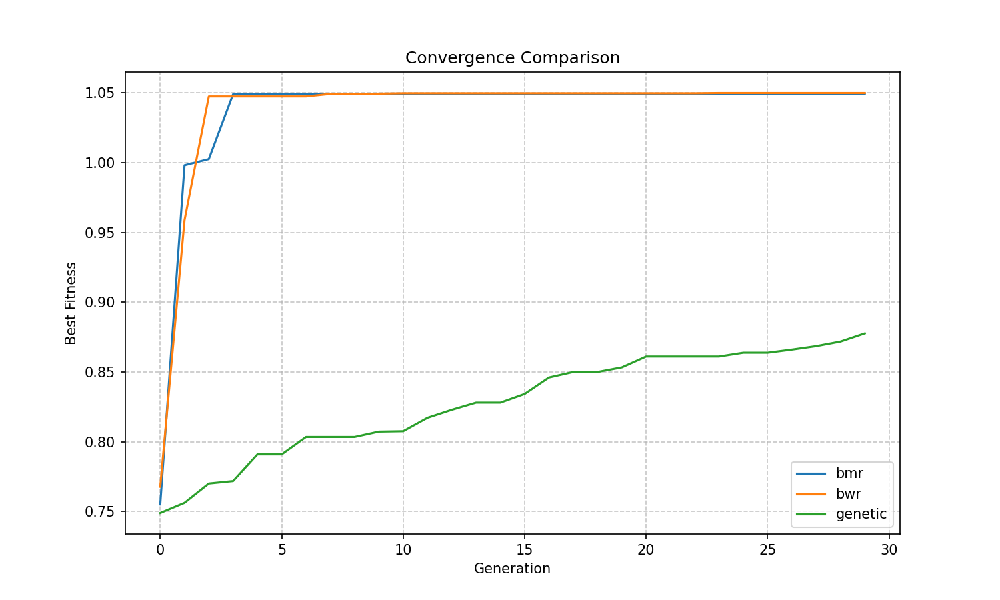
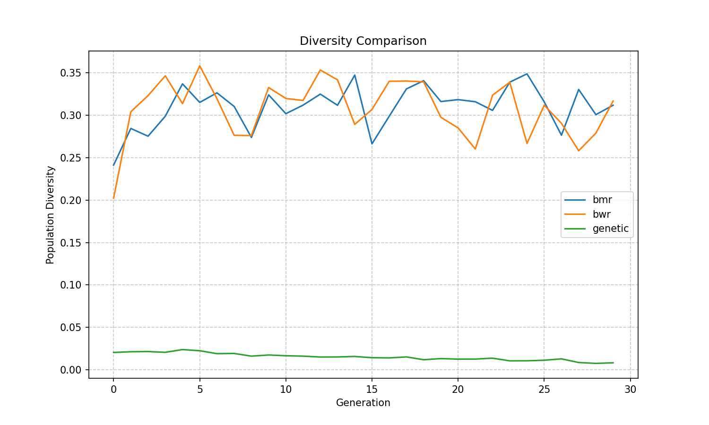
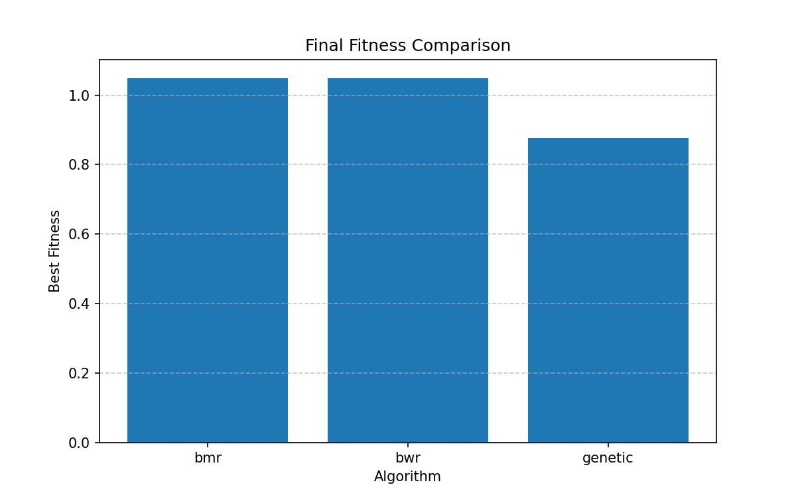

# BMR-Model-Merge Workflow Report
Generated on: 2025-06-25 14:50:19

## Overview
- Datasets processed: 2
- Algorithms compared: 3
- Best algorithm: bwr

## Dataset Summary
- receipts: 5 samples
- invoices: 5 samples

## Algorithm Results

| Algorithm | Best Fitness | Runtime (s) |
|-----------|--------------|-------------|
| bmr | 1.0495 | 0.09 |
| bwr | 1.0500 | 0.11 |
| genetic | 0.8776 | 0.14 |

## Plots

### Convergence Comparison

### Diversity Comparison

### Final Fitness Comparison
